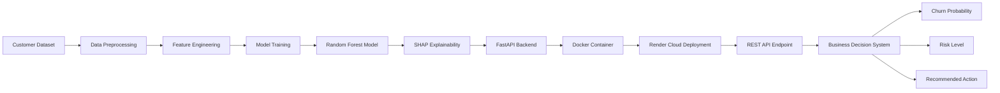

# 🚀 Customer Churn Prediction — End-to-End ML Production System

A production-ready machine learning system that predicts customer churn and exposes predictions through a deployed API.

This project demonstrates a complete ML lifecycle:

> Data → Model → Explainability → API → Docker → Cloud Deployment

---

## 📌 Business Problem

Customer churn is one of the biggest revenue risks for telecom companies.

Acquiring a new customer costs **5–7× more** than retaining an existing one.

This system helps businesses:

- Identify customers likely to churn  
- Understand why they may churn  
- Take proactive retention actions  

---

## 🧠 Solution Overview

Built an end-to-end ML pipeline that:

1. Predicts churn probability  
2. Explains key factors influencing churn  
3. Serves predictions through a REST API  
4. Runs inside a Docker container  
5. Deployed live on cloud  

## 🏗️ Architecture Diagram




## 📊 Dataset

Telecom customer churn dataset containing:

- Customer demographics  
- Subscription details  
- Billing & payment info  
- Internet services  
- Contract type  

Target variable:

- `Churn` (Yes / No)

---

## 🤖 Models Trained

Multiple models were trained and compared:

- Logistic Regression  
- Random Forest  
- XGBoost  
- Stacking Ensemble  

### ⭐ Final Production Model: Tuned Random Forest

**Why chosen:**

- Best recall for churn detection  
- Strong ROC-AUC performance  
- Stable and robust  
- Handles categorical feature interactions effectively  

---

## 📈 Model Performance

| Metric | Value |
|-------|------|
| Accuracy | ~72% |
| Recall | ~80% |
| Precision | ~49% |
| F1 Score | ~0.60 |
| ROC-AUC | ~0.84 |

### Why accuracy is not the priority?

In churn prediction:

- Missing a churn customer is costly  
- Recall & ROC-AUC matter more than raw accuracy  

This model prioritizes:

✔ identifying potential churn customers  
✔ reducing business risk  

---

## 🔍 Explainability (SHAP)

SHAP was used to interpret model decisions.

Top churn drivers:

- Contract type  
- Tenure  
- Monthly charges  
- Internet service  
- Payment method  

This enables:

- Model transparency  
- Business-level interpretability  

---

## 🌐 Live API

The trained model is deployed as a REST API using FastAPI.

### Endpoint

```
POST /predict
```

### Sample Request

```json
{
  "tenure": 5,
  "MonthlyCharges": 70,
  "TotalCharges": 350,
  "Contract": "Month-to-month",
  "InternetService": "Fiber optic",
  "PaymentMethod": "Electronic check"
}
```

### Sample Response

```json
{
  "churn_probability": 0.437,
  "risk_level": "Low",
  "recommended_action": "No action needed"
}
```

---

## 🐳 Docker Deployment

The API is containerized for portability and production readiness.

Benefits:

- Environment consistency  
- Easy deployment  
- Scalable architecture  

---

## ☁️ Cloud Deployment

Hosted on Render cloud platform.

Live service:

👉 https://churn-ml-api-6cir.onrender.com  
👉 https://churn-ml-api-6cir.onrender.com/docs  

---

## 🧰 Tech Stack

### Languages
- Python

### Machine Learning
- Scikit-learn  
- XGBoost  
- SHAP  

### Backend
- FastAPI  
- Uvicorn  

### Deployment
- Docker  
- Render  

### Data
- Pandas  
- NumPy  

---

## 📁 Project Structure

```
churn-ml-api/
│
├── model/
│   ├── churn_model.pkl
│   ├── model_columns.pkl
│
├── main.py
├── requirements.txt
├── Dockerfile
├── README.md
```

---

## 🎯 Key Learnings

- End-to-end ML deployment workflow  
- Feature engineering for churn prediction  
- Model evaluation for imbalanced datasets  
- SHAP explainability  
- API development with FastAPI  
- Docker containerization  
- Cloud deployment  

---

## 🌐 Live Demo

Dashboard UI:
https://YOUR-STREAMLIT-LINK.onrender.com

API Docs:
https://churn-ml-api-6cir.onrender.com/docs

---

## 🚀 Future Improvements

- Automated retraining pipeline  
- Model monitoring & logging  
- Model versioning  
- A/B testing  

---

## 👨‍💻 Author

**Mrityunjay Kumar**

Machine Learning | Computer Vision | Applied AI

---

## ⭐ Why this project stands out

This is not just a machine learning model.

It is a **production ML system** demonstrating:

✔ Model development  
✔ Explainability  
✔ Backend engineering  
✔ Deployment  
✔ Business decision logic  

Exactly what ML engineers build in real-world companies.
